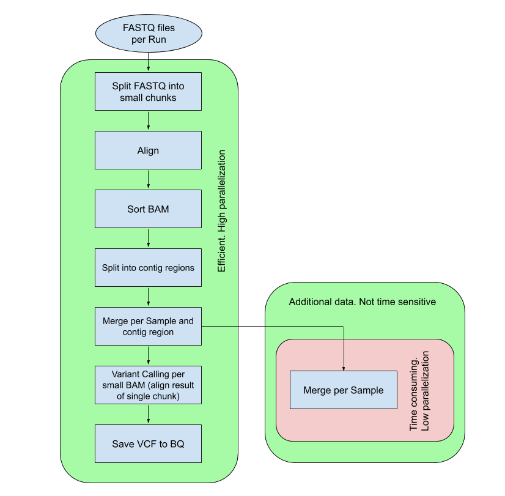

# Dataflow Genomics Core Components
Ready-to-use components for implementation fast and cost effective [Google Cloud Dataflow](https://cloud.google.com/dataflow) pipelines 
to solve genomics data processing tasks and post-processing analyze.

## Overview
Here you can find a wide list of components for building genomics data processing pipelines 
based on [Apache Beam](https://beam.apache.org/) unified programming model and runnable 
with [Google Cloud Dataflow](https://cloud.google.com/dataflow). Current package includes tools for:
- Building transformation graphs for Batch and Streaming processing of genomics data  
- Working with [SRA](https://www.ncbi.nlm.nih.gov/sra/) metadata annotations
- Retrieving genomics data from different sources, e.g. Web URL, [Google Cloud Storage](https://cloud.google.com/storage) or [NCBI SRA archive](https://www.ncbi.nlm.nih.gov/sra)
- Manipulations of [FASTQ](https://en.wikipedia.org/wiki/FASTQ_format) files
- Working with genome references in [FASTA](https://en.wikipedia.org/wiki/FASTA_format) format
- [Sequence alignment](https://en.wikipedia.org/wiki/Sequence_alignment)
- Different [SAM/BAM](https://samtools.github.io/hts-specs/SAMv1.pdf) data manipulations (Sorting, Merging, etc.) 
- [Variant Calling](https://www.ebi.ac.uk/training/online/course/human-genetic-variation-i-introduction-2019/variant-identification-and-analysis)
- Variant Calling results (VCF) export

### Efficiency
The usage of components from current library allows to build highly-scalable, parallel and efficient genomics data processing pipelines. 
Here is a principle schema of the pipeline  built on library components that identifies genetic variations from a DNA sequence data:

### Prerequisites
- [Java Development Kit](https://www.oracle.com/technetwork/java/javase/downloads/index.html) (JDK) __version 8__
- [Apache Maven](https://maven.apache.org/download.cgi)

For using [utilities](utilities):
- [Python](https://www.python.org/downloads/) (>=2.7)

### Structure
The repository contains two Maven modules:
- [genomics-dataflow-core](genomics-dataflow-core) - module with Dataflow Genomics Core Components Java source code
- [giab-example](giab-example) - module with demo project, that shows an example of usage of [genomics-dataflow-core](genomics-dataflow-core)

Also it contains set of [utilities](utilities) for dataset's metadata preparation.

### High-level components
There are several high-level Apache Beam PTransform classes, that could be used as the main building blocks for a custom genomics processing pipeline. 
Here are some of them:

- [RetrieveFastqFromCsvTransform](genomics-dataflow-core/src/main/java/com/google/allenday/genomics/core/preparing/RetrieveFastqFromCsvTransform.java) - provides a queue of data preparing transformations.                                                                            
It includes reading input CSV file ([example](docs/metada_examples/default_sample_runs_metadata_example.csv)), parsing, filtering, anomalies and broken data check, splitting into smaller runfile chunks.
Return ready to post-process (e.g. sequence aligning) key-value pair of [SampleMetaData](genomics-dataflow-core/src/main/java/com/google/allenday/genomics/core/model/SampleMetaData.java) 
and list of [FileWrapper](genomics-dataflow-core/src/main/java/com/google/allenday/genomics/core/model/FileWrapper.java) (with 1 element for single end read and 2 elements - for paired end reads)                         
- [AlignAndSamProcessingTransform](genomics-dataflow-core/src/main/java/com/google/allenday/genomics/core/processing/AlignAndSamProcessingTransform.java) - contains queue of genomics transformations, namely [Sequence alignment](https://en.wikipedia.org/wiki/Sequence_alignment) (FASTQ->SAM) 
implemented with [Minimap2AlignService](genomics-dataflow-core/src/main/java/com/google/allenday/genomics/core/processing/align/Minimap2AlignService.java) 
and [BwaAlignService](genomics-dataflow-core/src/main/java/com/google/allenday/genomics/core/processing/align/BwaAlignService.java), 
splitting into smaller SAM chunks, converting to binary format (SAM->BAM), 
sorting BAM and merging BAM in scope of specific [contig](https://en.wikipedia.org/wiki/Contig) region. 
- [VariantCallingTransform](genomics-dataflow-core/src/main/java/com/google/allenday/genomics/core/processing/variantcall/VariantCallingTransform.java) - PTransform that provides [Variant Calling](https://www.ebi.ac.uk/training/online/course/human-genetic-variation-i-introduction-2019/variant-identification-and-analysis) logic. Currently supported [GATK Haplotaype Caller](https://gatk.broadinstitute.org/hc/en-us/articles/360037225632-HaplotypeCaller) and  [Deep Variant](https://github.com/google/deepvariant) pipeline from Google.
- [PrepareAndExecuteVcfToBqTransform](genomics-dataflow-core/src/main/java/com/google/allenday/genomics/core/processing/vcf_to_bq/PrepareAndExecuteVcfToBqTransform.java) - Apache Beam PTransform that groups Variant Calling results (VCF) of contig regions and exports them into the [BigQuery](https://cloud.google.com/bigquery) table. Uses vcf-to-bigquery transform from [GCP Variant Transforms](https://github.com/googlegenomics/gcp-variant-transforms)

### Sequence aligning
By default, [minimap2](https://github.com/lh3/minimap2) aligner is used for Sequence aligning stage. 
Optionally, can be used [BWA](https://github.com/lh3/bwa) aligner by passsing `--aligner=BWA` to the Apache Beam PipelineOptions.

Also, you can add a custom aligner by extending [AlignService](genomics-dataflow-core/src/main/java/com/google/allenday/genomics/core/processing/align/AlignService.java) class

### Variant Calling
By default, pipeline uses [GATK Haplotaype Caller](https://gatk.broadinstitute.org/hc/en-us/articles/360037225632-HaplotypeCaller).
Optionally there is a possibility to run the pipeline with a [Deep Variant](https://github.com/google/deepvariant) variant caller. To do this you should pass `--variantCaller=DEEP_VARIANT` to the Apache Beam PipelineOptions.

Also, you can add a custom variant caller by extending [VariantCallingService](genomics-dataflow-core/src/main/java/com/google/allenday/genomics/core/processing/variantcall/VariantCallingService.java) class

## Usage
This repository contains an [example](giab-example) of usage of Dataflow Genomics Core Components library, that provides a demo pipeline with batch processing of the [NA12878](https://www.coriell.org/0/Sections/Search/Sample_Detail.aspx?Ref=NA12878&product=DNA) sample from [Genome in a Bottle](https://www.nist.gov/programs-projects/genome-bottle).
 
### Already used by
[Nanostream Dataflow](https://github.com/allenday/nanostream-dataflow) - a scalable, reliable, and cost effective end-to-end pipeline for fast DNA sequence analysis using Dataflow on Google Cloud

[GCP-PopGen Processing Pipeline](https://github.com/allenday/gcp-popgen) - a repository, that contains a number of Apache Beam pipeline configurations for processing different populations of genomes (e.g. Homo Sapiens, Rice, Cannabis)
### Testing
Repository contains unit test that covers all main components and one end-to-end integration test.
For integration testing you have to configure `TEST_BUCKET` environment variable.
